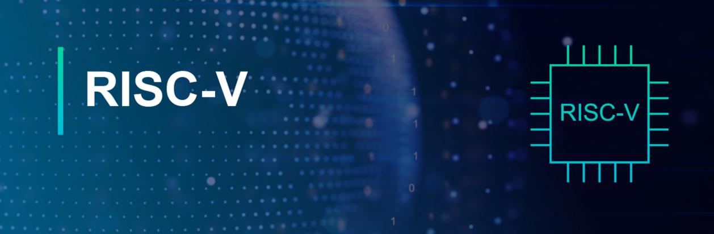

# Open Source Prototype Systems

course projects for "Open Source Prototype Systems and Applications (2026 Spring)" at NSYSU

## Projects

 Projects   | Descriptions
--------|:-----
[Project 1][1]| RV32I Single-Cycle Baseline Processor
[Project 2-1][2]| RV32I Pipelined Processor with Cache Subsystem
[Project 2-2][3]| Gem5 Histogram Worklaod Profiling

[1]: project1/
[2]: project2_1/
[3]: project2_2/

