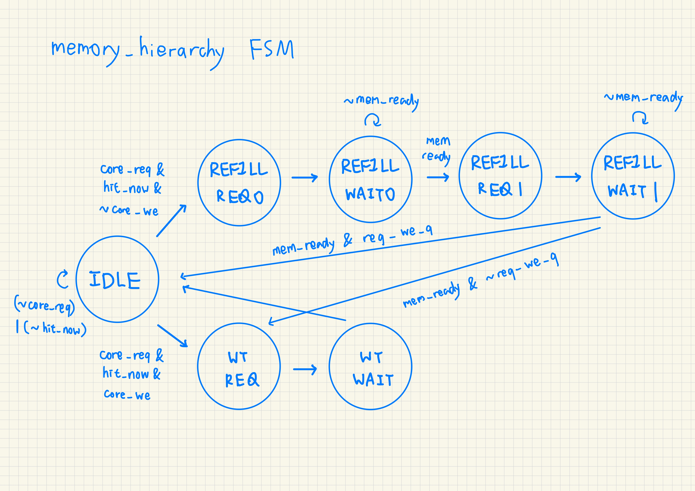

# Week 6 Lab. Cache Behavior Traces: 3C Model, Locality, and Write Reuse

## 1. Introduction

On an L1-cache backed by a 3-cycle-latency RAM, five hand-written RISC-V programs each stresses a distinct access pattern — capacity pressure, conflict thrashing, spatial locality, temporal locality, and write reuse — to reveal, in cycle counts, how the cache rewards sequential and repeated access while punishing address patterns that collide in the same cache index. Students will first complete the marked TODOs in `memory_hierarchy.sv` — restoring hit detection and the read/write hit paths — then run all five programs and observe how each workload's access pattern produces a distinct hit rate and CPI.

## 2. Workflow

``` bash
$ bash run.sh
```

## 3. Memory Hierarchy Design

- **cache policy**: direct-mapped, write-through, write-allocate
- **capacity**: lines = 2, words per line = 2

<p align="center"></p>

A simple req/ready handshake connects `memory_hierarchy` to `backing_ram`. The FSM in the cache controller sequences word-by-word line refills (two separate word requests, `ST_REFILL_REQ0/WAIT0` → `ST_REFILL_REQ1/WAIT1`) and write-through updates (`ST_WT_REQ/WAIT`), stalling the core pipeline by withholding `core_ready` until each operation completes. `backing_ram` models a parameterized access latency (default 3 cycles) rather than a real SRAM interface.

## 4. Memory Access Patterns

### 4.1 Capacity Misses (`program_capacity.S`)

``` S
# Capacity pressure: five blocks touched before reusing the first
addi x1, x0, 0
lw   x3, 0(x1)
lw   x4, 8(x1)
lw   x5, 16(x1)
lw   x6, 24(x1)
lw   x7, 32(x1)
lw   x3, 0(x1)
.word 0xffffffff
```

### 4.2 Conflict Misses (`program_conflict.S`)

``` S
# Conflict misses: 0x00 and 0x20 map to same line in 4-line, 2-word/line cache
addi x1, x0, 0
addi x2, x0, 32
lw   x3, 0(x1)
lw   x4, 0(x2)
lw   x5, 0(x1)
lw   x6, 0(x2)
.word 0xffffffff
```

### 4.3 Spatial Locality (`program_spatial.S`)

``` S
# Spatial locality: adjacent words inside then across blocks
addi x1, x0, 0
lw   x3, 0(x1)
lw   x4, 4(x1)
lw   x5, 8(x1)
lw   x6, 12(x1)
.word 0xffffffff
```

### 4.4 Temporal Locality (`program_temporal.S`)

``` S
# Temporal locality: same address loaded repeatedly
addi x1, x0, 0
lw   x3, 0(x1)
lw   x4, 0(x1)
lw   x5, 0(x1)
lw   x6, 0(x1)
.word 0xffffffff
```

### 4.5 Write Reuse (`program_write_reuse.S`)

``` S
# Store + reuse: useful for write-through / write-allocate discussion
addi x1, x0, 64
addi x2, x0, 5
sw   x2, 0(x1)
lw   x3, 0(x1)
sw   x2, 4(x1)
lw   x4, 4(x1)
.word 0xffffffff
```

## 5. Result

| Metric               | Capacity | Conflict | Spatial | Temporal | Write Reuse |
|----------------------|:--------:|:--------:|:-------:|:--------:|:-----------:|
| Total cycles         | 88       | 62       | 40      | 30       | 46          |
| Retired instructions | 7        | 6        | 5       | 5        | 6           |
| Memory accesses      | 12       | 8        | 8       | 8        | 6           |
| Reads                | 12       | 8        | 8       | 8        | 2           |
| Writes               | 0        | 0        | 0       | 0        | 4           |
| Cache hits           | 6        | 4        | 6       | 7        | 5           |
| Cache misses         | 6        | 4        | 2       | 1        | 1           |
| Hit rate             | 0.500    | 0.500    | 0.750   | 0.875    | 0.833       |
| Approx CPI           | 12.57    | 10.33    | 8.00    | 6.00     | 7.67        |

**Temporal** achieves the best hit rate (0.875) and lowest CPI (6.00): after the cold miss on the first load, the same cache line is reused three more times with zero backing-RAM traffic. The single miss penalty is amortized across four accesses.

**Spatial** is the next best (hit rate 0.750, CPI 8.00). Each 2-word cache line fill covers two adjacent addresses, so loading four consecutive words incurs only two misses instead of four. The second word of every filled line is a free hit.

**Write Reuse** (hit rate 0.833, CPI 7.67) performs well on reads — the write-allocate policy brings the written line into cache, so the immediately following loads hit — but every write still forces a backing-RAM round trip under write-through, which raises cycle count versus a write-back design with the same access pattern.

**Conflict** and **Capacity** both land at 0.500 hit rate, but for different reasons. Conflict (CPI 10.33) thrashes just two addresses that happen to map to the same cache index: every load evicts the other. Capacity (CPI 12.57) is worse because it touches more distinct lines (six blocks across six loads), so the small 2-line cache cannot hold working-set data long enough for any reuse beyond the free second word from each fill.

## 6. Conclusion

Access pattern dominates cache performance far more than raw cache size in these benchmarks. Temporal reuse cuts CPI in half compared to the worst case, while conflict misses can be just as damaging as capacity misses even when the working set is tiny — two addresses are enough to thrash a direct-mapped cache if they share an index. Write-through adds a backing-RAM round trip on every store regardless of hit or miss, visibly raising CPI in the write-reuse case even though the subsequent reads all hit.

Going forward, the most accessible lever is the workload's own access pattern: walking data sequentially amortizes each line fill across multiple accesses, reordering loops so the innermost index steps through contiguous memory turns capacity misses into hits, and keeping the active working set small enough to revisit before eviction converts cold misses into temporal-locality hits. These choices also inform hardware co-design — a write-heavy workload justifies switching from write-through to write-back to eliminate the per-store backing-RAM penalty, while a workload with a well-characterized working set size and stride suggests tuning cache capacity and associativity to match, eliminating the conflict and capacity misses at their source rather than absorbing them in cycle count.
