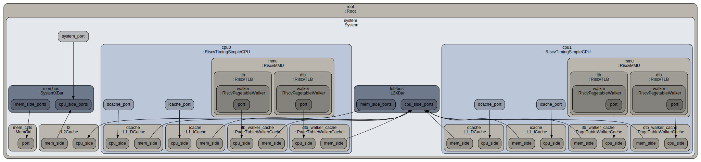

# Week 11 Lab 2. Producer-Consumer Multithreading Dual-CPU Synchronization

## 1. Introduction

This lab contains a lightweight producer-consumer workload under gem5 simulation. The workload demonstrates thread synchronization and inter-thread communication on a simulated dual-CPU system using POSIX threads `<pthread.h>` and GCC atomic operations, which is ideal for studying cache behavior, memory ordering, and multi-threaded performance under small core counts.

## 2. Workflow

Run with default settings (2048 iterations):

```bash
$ bash run_producer_consumer.sh
CONSUMER role=consumer iterations=2048 observed_iters=2048 observed_sum=2098176 expected=2098176
PRODUCER role=producer iterations=2048 sum=2098176
PRODUCER_CONSUMER PASS
```

1. Script locates gem5, se.py config, and RISC-V compiler
2. Compiles `workloads/producer_consumer.c` to RISC-V binary
3. Simulates the binary on a 2-core system with caches
4. Outputs results to `m5out/producer_consumer/`
5. Displays key statistics and workload output

## 3. System Under Simulation

- **2 CPUs**: TimingSimpleCPU (in-order, timing memory accesses)
- **L1 caches**: 32 KB instruction cache, 32 KB data cache per CPU (typical)
- **L2 cache**: unified 256 KB cache (shared)
- **Memory**: 512 MB (enough for this workload)

<p align="center"></p>

## 4. Workload

- **Two threads** (one producer, one consumer) in a single process
- **No host-file IPC**: avoids unsupported syscalls like `renameat2`
- **Shared-memory synchronization** via global mailboxes and atomic loads and stores
- **Release-acquire semantics** to ensure cache coherency across CPUs

### 4.1 Producer Role (pthread)

- Computes the sum: $\sum_{i=1}^{N} i = \frac{N(N+1)}{2}$.
- Writes iteration count to `mailbox_iters` and result to `mailbox_sum` with **relaxed atomics** (no ordering). These two memory accesses make up the **critical section**.
- Calls `deterministic_delay()` every 64 iterations to simulate realistic work.
- Issues a **release-store** to `mailbox_ready` to publish ready flag.

``` C
// Publish payload before publishing the ready flag.
__atomic_store_n(&mailbox_sum, sum, __ATOMIC_RELAXED);
__atomic_store_n(&mailbox_iters, iterations, __ATOMIC_RELAXED);
__atomic_store_n(&mailbox_ready, 1, __ATOMIC_RELEASE);
```

### 4.2 Consumer Role (Main Thread)

- Spin-waits on `mailbox_ready` using **acquire-load** (enforces ordering)
- Once producer signals, reads `mailbox_sum` with relaxed atomics (safe because acquire ordered it)
- Compares observed sum against expected value $\frac{N(N+1)}{2}$
- Prints PASS if they match, FAIL otherwise

``` C
const int max_polls = 2000000;

int ready = 0;
for (int p = 0; p < max_polls; p++) {
    ready = __atomic_load_n(&mailbox_ready, __ATOMIC_ACQUIRE);
    if (ready) break;
    if ((p & 255) == 0) deterministic_delay(16);
}

if (!ready) {
    printf("PRODUCER_CONSUMER FAIL: consumer timeout waiting for ready flag\n");
    return 2;
}

uint64_t observed_sum = __atomic_load_n(&mailbox_sum, __ATOMIC_RELAXED);
int observed_iters = __atomic_load_n(&mailbox_iters, __ATOMIC_RELAXED);
uint64_t expected = expected_sum(iterations);
```

### 4.3 Synchronization Pattern

``` text
Producer:  store(mailbox_sum, sum, RELAXED) // critical section
           store(mailbox_iters, N, RELAXED) // critical section
           store(mailbox_ready, 1, RELEASE)  ← publishes visibility
                                               
Consumer:  while (!load(mailbox_ready, ACQUIRE)) { spin; }  ← waits, acquires
           sum_obs = load(mailbox_sum, RELAXED)  ← safe: acquire ordered it
           iters_obs = load(mailbox_iters, RELAXED)
           verify(sum_obs == expected_sum(N))
```

- A release-store by producder and aquire-load spinlock by consumer on `mailbox_ready` enforces correctness in inter-thread communication (ITC), even on weakly-ordered memory models.
- While spinlock (busy-waiting) works well on small core counts in this example, blocking locks perform better for larger core counts but sleep/wakeup overhead ensues.

## 5. Result

The statistics below are from a successful 2048-iteration run. They reveal cache behavior, memory system efficiency, and per-core performance characteristics.

### 5.1 Overall System Performance

| Metric | Value | Description |
|--------|-------|-------------|
| **simTicks** | 374,372,500 | Total simulation time across all cores |
| **simInsts** | 202,166 | Total instructions executed |
| **hostSeconds** | 0.18 | Wall-clock time elapsed on host machine |
| **IPC** | ~0.27 | Instructions per cycle (typical for in-order CPUs with memory delays) |

### 5.2 CPU Performance

#### CPU0 (Consumer, Main Thread)

**total cycles** = 748,745

| Metric | Accesses | Misses | Miss Rate | Description |
|--------|----------|--------|-----------|-------------|
| **L1-DCache** | 35,113 | 1,243 | 3.5% | high miss rate due to spin-waiting on mailbox |
| **L1-ICache** | 206,447 | 521 | 0.25% | tight polling loop |

#### CPU1 (Producer, pthread)

**total cycles** = 733,365

| Metric | Accesses | Misses | Miss Rate | Description |
|--------|----------|--------|-----------|-------------|
| **L1-DCache** | 8,399 | 96 | 1.1% | low miss rate, tight inner loop |
| **L1-ICache** | 31,091 | 142 | 0.46% | simple accumulation loop |

- number of cycles: CPU0 > CPU1 (CPU1 is the child thread)
- instruction accesses: CPU0 >> CPU1 (consumer is polling)
- Both cores run nearly in parallel (~733k to ~748k cycles) with minimal synchronization overhead

### 5.4 L2 Unified Cache Summary

| Component | CPU0 | CPU1 | Total |
|-----------|-------|-------|-------|
| **Demand Misses (Inst)** | 474 | 82 | 556 |
| **Demand Misses (Data)** | 1,169 | 43 | 1,212 |
| **Total Misses** | 1,643 | 125 | 1,768 |
| **Total Accesses** | 1,744 | 207 | 1,951 |
| **Hit Rate** | 90.6% | 93.6% | - |

### 5.5 Observations

- **No prefetch activity**: demand misses = overall misses
- **CPU0 is more memory-intensive**: 35k data accesses vs. 31k for CPU1 shows consumer doing more memory work (spinning)
- **Inter-thread communication (ITC) is efficient**: Atomic operations and cache coherency work correctly; no deadlock observed
- **Small working set**: ~40k total L1 accesses + ~1,951 L2 accesses suggests the workload fits well within cache hierarchy; no excessive cache thrashing

## 6. Conclusion

This lab demonstrated how to build and simulate a two-thread producer-consumer workload on a RISC-V dual-CPU system in gem5. In this lab, release-acquire semantics are essential for correctness: a release store on the ready flag paired with an acquire load on the consumer side is the minimal ordering that guarantees the consumer sees the producer's payload. `CPU0`'s 3.5% L1 D-cache miss rate vs `CPU1`'s 1.1% directly reflects the spin-wait polling pattern rather than any algorithmic inefficiency.

Going forward, the key practice is to always protect shared mutable data with appropriate synchronization — the right primitive depends on the use case: **spinlocks** for short, low-contention waits; **mutexes and condition variables** for longer or higher-contention scenarios where blocking is cheaper than polling; **semaphores** for coordinating access to a shared resource pool or signaling between multiple producers and consumers; and atomic operations with explicit memory ordering (such as the release-store/acquire-load pair used here) for lightweight, lock-free inter-thread communication (ITC). Each primitive carries its own deadlock risk — mutexes deadlock under circular acquisition order, semaphores under mismatched signal/wait counts — so the general discipline is to define a strict lock ordering, hold locks for the shortest possible duration, and always pair every acquire with a guaranteed release. Always add a timeout to spin-waits to prevent indefinite blocking if a cooperating thread fails.
