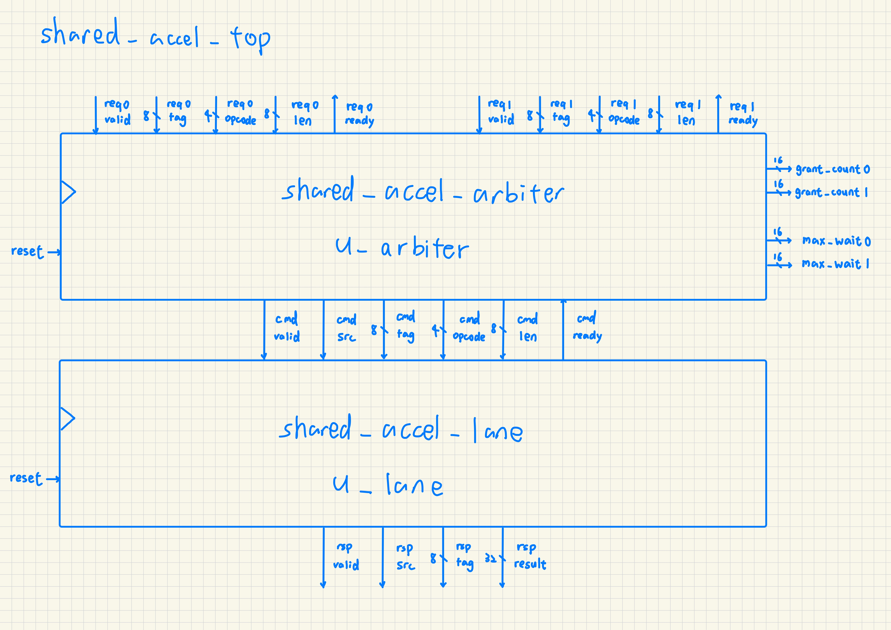

# Week 15 Lab. Fair-Shared Accelerator Arbitration: Round-Robin and Aging

## 1. Introduction

In this lab, the given baseline fixed-priority accelerator arbiter (`rtl/shared_accel_arbiter.sv`) implementation is functionally correct but unfair under contention. The round-robin (`ARB_POLICY == 1`) and round-robin with aging (`ARB_POLICY == 2`) branches have to be implemented to improve arbitration fairness, which is observed through the fairness counters kept in `tb/tb_shared_accel_arbiter.sv`. Finally, the impact on area (`Number of Cells`) of the round robin and aging logic can be observed through the YOSYS synthesis reports.

## 2. Workflow

``` bash
$ bash run.sh
```

## 3. System Architecture

<p align="center"></p>

- `rtl/shared_accel_top.sv`: top-level wrapper connecting arbiter and lane
- `rtl/shared_accel_arbiter.sv`: implement round robin and aging policies here
- `rtl/shared_accel_lane.sv`: fixed-latency accelerator lane

Two requesters share one fixed-latency accelerator lane. Each requester sends tagged commands. The lane returns a deterministic result based on source, tag, opcode, and length. The arbiter chooses which requester gets access when both are valid.

## 4. Arbitration Policies (`rtl/shared_accel_arbiter.sv`)

### 4.1 Fixed Priority

``` sv
// Baseline: fixed priority favors requester 0.
if (req0_valid) begin
    grant0_sel = 1'b1;
end else if (req1_valid) begin
    grant1_sel = 1'b1;
end
```

### 4.2 Round Robin

``` sv
if (req0_valid && req1_valid) begin
    // both want the bus =>
    // alternate based on who went last
    grant0_sel = (last_grant == 1'b1);
    grant1_sel = (last_grant == 1'b0);
end else if (req0_valid) begin
    grant0_sel = 1'b1;
end else if (req1_valid) begin
    grant1_sel = 1'b1;
end
```

### 4.3 Round Robin + Aging

``` sv
aged0 = req0_valid & & (cur_wait0 >= AGE_LIMIT_SIZED);
aged1 = req1_valid & & (cur_wait1 >= AGE_LIMIT_SIZED);

if (aged0 && aged1) begin
    // both starved - grant the longer waiter (ties go to req0)
    grant0_sel = (cur_wait0 >= cur_wait1);
    grant1_sel = (cur_wait1 > cur_wait0);
end else if (aged0) begin
    grant0_sel = 1'b1;
end else if (aged1) begin
    grant1_sel = 1'b1;
end else if (req0_valid && req1_valid) begin
    // neither aged - fall back to RR
    grant0_sel = (last_grant == 1'b1);
    grant1_sel = (last_grant == 1'b0);
end else if (req0_valid) begin
    grant0_sel = 1'b1;
end else if (req1_valid) begin
    grant1_sel = 1'b1;
end
```

## 5. Result

| policy | `max_wait0` | `max_wait1` | description |
|---|---|---|---|
| fixed priority | 4 | 160 | correct but unfair under contention |
| round robin | 9 | 9 | improves worst-case waiting time |
| round robin + aging | 9 | 9 | eliminates starvation |

## 6. YOSYS Area Report

This table compares `Number of Cells` of `shared_accel_arbiter` across arbitration policies. This result can be found at the end of each file under `yosys_reports/<policy>_area.txt`. Note that this is not a final timing closure result.

| fixed priority | round robin | round robin + aging |
|-----|-----|-----|
| 478 | 485 | 684 |

We can observe that the aging logic does cost significant area overhead, which can be attributed to the deeper MUX. Further optimizations can be carried out to balance the circuit PPA.

## Conclusion

From this lab, I learned that how arbitration unfairness leads to starvation, and how a simple round-robin policy can alleviate this issue. Despite the addition of aging logic not changing max waiting time in this lab, it can be helpful when more requestors come in and load imbalance is present. I also learned that we can use `max_wait_time` performance counters to detect arbitration unfairness. Going forward, we should keep in mind that functional correctness alone is insufficient for a robust prototype system and arbitration fairness should be enforced in a multiple requestor system.
