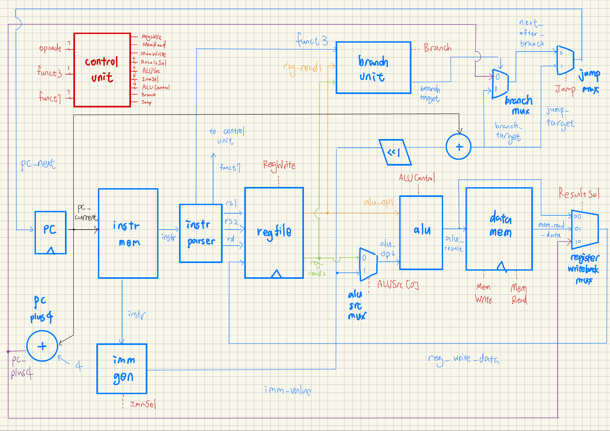

# Project 1. RV32I Single-Cycle Baseline Processor

## 1. Block Diagram

<p align="center"></p>

* all wires are 32-bit wide except for the output signals of controller and instruction parser

## 2. Supported Commands

This baseline processor supports a specific subset of the RISC-V ISA

| Instruction Class | Supported Instructions |
| :--- | :--- |
| **R-type** | `add`, `sub`, `and`, `or`, `xor`, `sll`, `srl`, `sra`, `slt`, `sltu` |
| **I-type** | `addi`, `andi`, `ori`, `xori`, `slli`, `srli`, `srai`, `slti`, `sltiu` |
| **Memory** | `lw`, `sw` |
| **Branches** | `beq`, `bne`, `blt`, `bge` |
| **Jump** | `jal` |

## 3. Design Philosophy

This work serves as a **fundamental baseline design**. It will require further pipelining and extensive PPA (Power, Performance, Area) optimization to meet real-world implementation demands.

## 4. Verification

The datapath is verified using the following program

```bash
./run.sh
```

* `tb/testbench.sv`: integration test + pc test
* `tb/alu_tb.sv`, `tb/control_unit_tb.sv`, `tb/imm_gen_tb.sv`, `tb/regfile_tb.sv`: unit tests

``` c
int memory[]; // Represents your single-cycle processor's Data Memory

void main() {
    // 1. Initialize Pointers
    int* sp = 100; // Stack Pointer (x2)
    int* fp = 100; // Frame Pointer (x8)

    // 2. Initialize Memory Array (Base Address 0x0)
    int* arr = &memory[0];
    arr[0] = 5;
    arr[1] = -4;

    // 3. Local Temporary Variables
    int t0 = 15; // x5
    int t1 = 25; // x6

    // CALLER-SAVE (Spilling temporaries before the call)
    sp = sp - 8;
    memory[sp + 4] = t0; 
    memory[sp + 0] = t1; 

    // 4. Setup Arguments and Call Function
    int a0 = do_math(arr, 2); // Passing base address (x10) and length (x11)

    // CALLER-RESTORE (Filling temporaries after the call)
    t1 = memory[sp + 0];
    t0 = memory[sp + 4];
    sp = sp + 8;

    // 5. Success and Halt
    int a4 = 999; // x14 (Success indicator)
    
    while(true) {} // jal x0, 0 (Infinite loop to safely freeze datapath state)
}

int do_math(int* base_address, int length) {
    // PROLOGUE / CALLEE-SAVE 
    // (Claiming frame space & protecting callee-saved fp)
    sp = sp - 16;
    memory[sp + 12] = fp;
    fp = sp + 16;

    // LOOP BODY
    // i represents x7 (t2)
    for (int i = 0; i < length; i++) {
        
        int current_val = base_address[i];     // lw x29, 0(x10)
        
        int shifted_left = current_val << 2;   // slli x30, x29, 2
        int shifted_right = shifted_left >> 1; // srai x30, x30, 1 (Arithmetic shift)
        
        base_address[i] = shifted_right;       // sw x30, 0(x10)
    }

    int return_val = 99; // Dummy return value into x10 (a0)

    // EPILOGUE / CALLEE-RESTORE
    // (Cleaning up frame & restoring fp and sp)
    fp = memory[sp + 12];
    sp = sp + 16; 

    return return_val; // jal x0, -84 (Return to caller)
}
```

## 5. Known Limitations

* This work only supports a limited subset of RISC-V instructions. Notably, U-type instructions and `jalr` are not supported.
* Although this project aims for synthesizable code, the current single-cycle design is unoptimized and will definitely destroy the timing closure of any physical implementation.

## 6. Implemented Modules

* design
    * `single_cycle_top.sv`
    * `adder.sv`
    * `alu.sv`
    * `branch_unit.sv`
    * `control_unit.sv`
    * `data_mem.sv`
    * `imm_gen.sv`
    * `instr_mem.sv`
    * `instr_parser.sv`
    * `mux2.sv`
    * `pc.sv`
    * `regfile.sv`

* testbench
    * `tb/testbench.sv`
    * `tb/alu_tb.sv`
    * `tb/control_unit_tb.sv`
    * `tb/imm_gen_tb.sv`
    * `tb/regfile_tb.sv`
