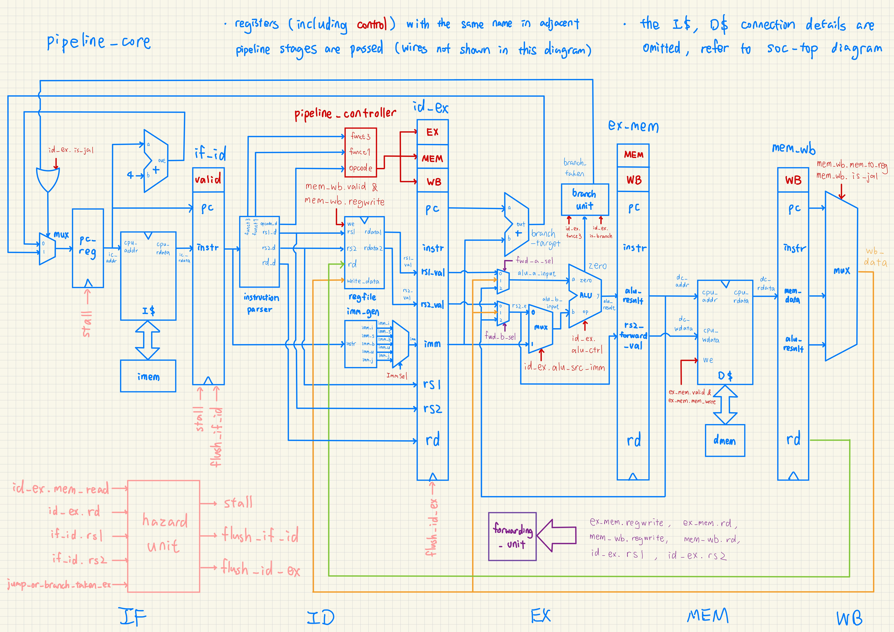
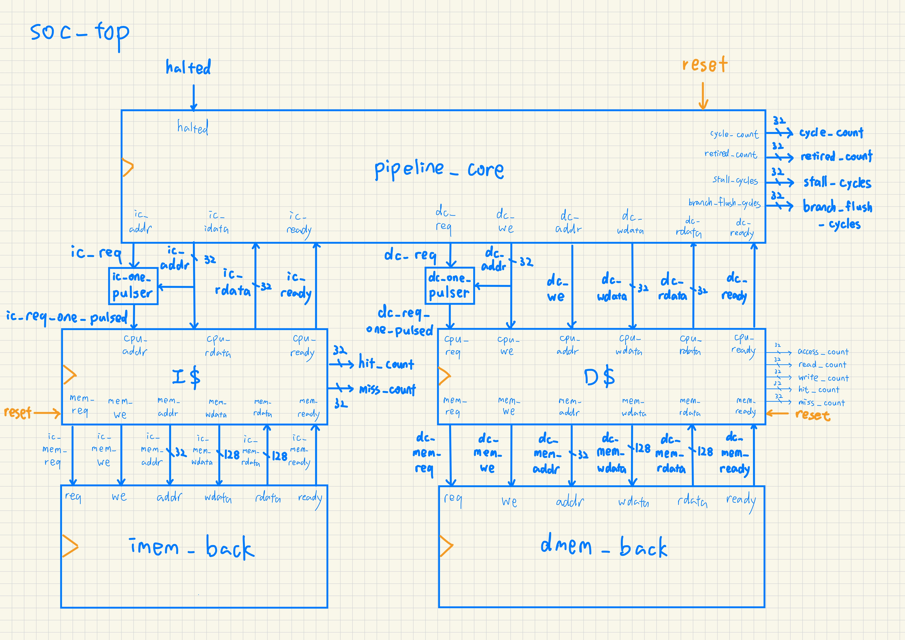
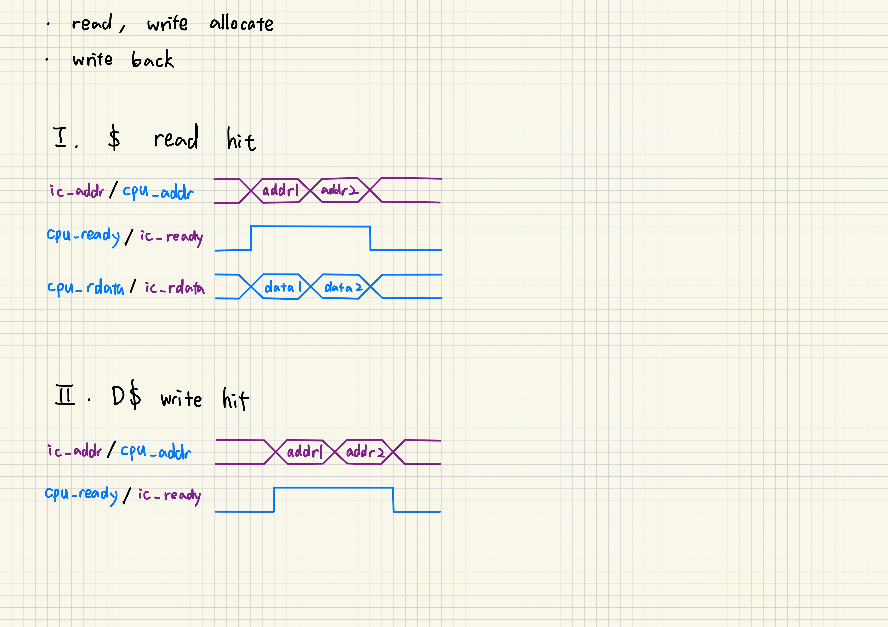
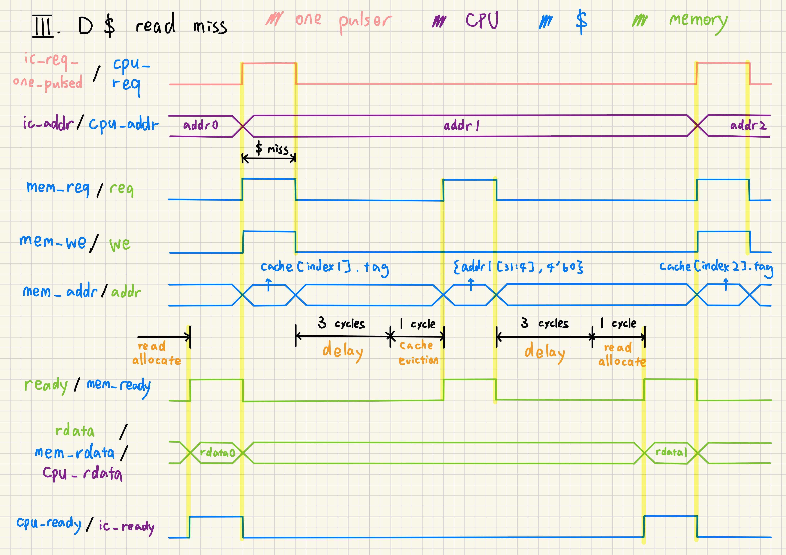
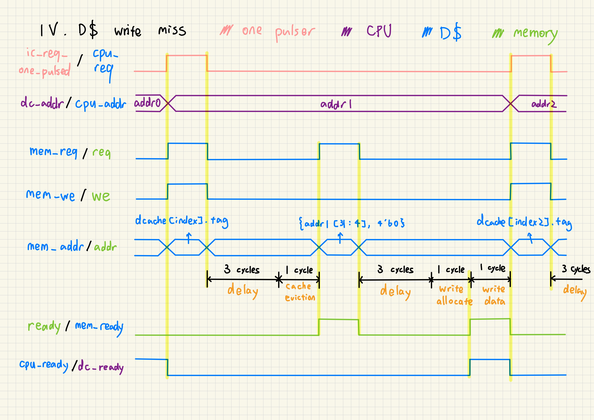

# Project 2. RV32I Pipelined Processor with Cache Subsystem

## 1. 5-Stage Pipelined Processor

The core utilizes a classic **5-stage pipeline** equipped with hazard detection and data forwarding to resolve dependencies. In this design, the branch is always **predicted not taken**. It also supports a custom `halt sentinel` instruction to cleanly terminate execution.

## 2. Supported Commands

The datapath implements a subset of the **RV32I** base instruction set:

| Instruction Type | Instructions |
| :--- | :--- |
| **R-type** | `add`, `sub` |
| **I-type** | `addi`, `lw` |
| **S-type** | `sw` |
| **B-type** | `beq`, `bne` |
| **J-type** | `jal` |
| **Other** | `halt sentinel` |

## 3. Cache Subsystem

The memory hierarchy leverages a **Harvard architecture** with separate instruction and data caches. Both caches feature a **capacity of 4 lines** with **4 words per line**. Both caches are **direct-mapped** and **read allocate**, while the data cache specifically utilizes **write allocate** and **write-back** policies. Additionally, both implement a **blocking cache** architecture.

### 3.1. Cache Timing Diagram

### 3.1. Cache Controller

## 4. Verification & Performance

Execution correctness and cycle counts are verified against multiple workloads:

| Test Case | passthru | icache | icache+dcache |
| :--- | :--- | :--- | :--- |
| `no-haz` | 54 | 24 | 24 |
| `forwarding` | 54 | 24 | 24 |
| `branch-taken` | 54 | 24 | 24 |
| `temporal` | 59 | 29 | 29 |
| `conflict` | 80 | 45 | 35 |

**Observation:** Because there are few memory instructions in our test programs and little cache conflict, the data cache addition primarily benefits the `conflict` access test case. 

## 5. Known Limitations

* **Backing RAM Bandwidth:** While a **128-bit** memory bus simplifies implementation, it causes severe routing congestion in physical logic. A practical physical design would narrow this data interface and serialize the cache-line fetch using **DRAM burst reads**.
* **Critical Path Timing:** The current cache miss path—where data flows from the backing RAM, through the cache controller, and directly into the CPU within a single cycle—will most definitely trigger a **timing violation**, which requires further pipelining to meet practical frequency targets.
