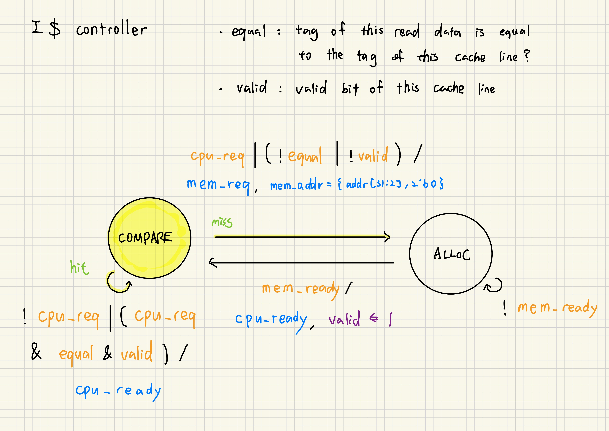
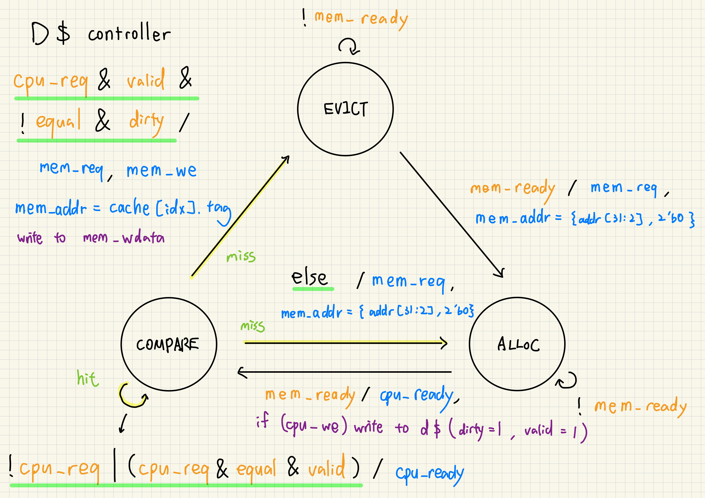

# Project 2-1. RV32I Pipelined Processor with Cache Subsystem

## 1. Introduction

This project implements a **RV32I pipelined processor** with a two-level memory hierarchy. The processor uses a classic 5-stage pipeline (IF, ID, EX, MEM, WB) with hazard detection and data forwarding, and is paired with separate instruction and data caches sitting in front of a backing RAM.

The primary goal is to demonstrate the performance impact of caching on a pipelined core. Three configurations are evaluated—passthrough (no cache), instruction cache only, and instruction + data cache—to isolate each tier's contribution to cycle-count reduction across a set of targeted workloads.

## 2. Design

### 2.1 5-Stage Core Pipeline

<p align="center"></p>

- branches always **predicted not taken**
- harzard detection
- data forwarding
- a custom `halt sentinel` instruction to cleanly terminate execution is supported

The datapath implements a subset of the **RV32I** base instruction set:

| Instruction Type | Instructions |
| :--- | :--- |
| **R-type** | `add`, `sub` |
| **I-type** | `addi`, `lw` |
| **S-type** | `sw` |
| **B-type** | `beq`, `bne` |
| **J-type** | `jal` |
| **Other** | `halt sentinel` |

### 2.2 Memory Hierarchy

<p align="center"></p>

- Harvard architecture
- direct-mapped (set associativity = 1)
- 4 words per line
- blocking (no MLP)
- read-allocate
- write-allocate (d$)
- write-back (d$)

### 2.3 Cache Timing Diagram

<p align="center"></p>
<p align="center"></p>
<p align="center"></p>

### 2.4 Cache Controller

<p align="center"></p>
<p align="center"></p>

## 4. Result

Execution correctness and cycle counts are verified against multiple workloads:

``` bash
$ bash run.sh
```

| Test Case | passthru | icache | icache+dcache |
| :--- | :--- | :--- | :--- |
| `no-haz` | 54 | 24 | 24 |
| `forwarding` | 54 | 24 | 24 |
| `branch-taken` | 54 | 24 | 24 |
| `temporal` | 59 | 29 | 29 |
| `conflict` | 80 | 45 | 35 |

**Observation:** Because there are few memory instructions in our test programs and little cache conflict, the data cache addition primarily benefits the `conflict` access test case. 

## 5. Known Limitations

- **Backing RAM Bandwidth:** While a **128-bit** memory bus simplifies implementation, it causes severe routing congestion in physical logic. A practical physical design would narrow this data interface and serialize the cache-line fetch using **DRAM burst reads**.
- **Critical Path Timing:** The current cache miss path—where data flows from the backing RAM, through the cache controller, and directly into the CPU within a single cycle—will most definitely trigger a **timing violation**, which requires further pipelining to meet practical frequency targets.

## 6. Conclusion

The pipelined RV32I core with a blocking, direct-mapped cache subsystem and verifies functional correctness across all test workloads. Adding the instruction cache alone eliminates a significant fraction of memory-access cycles, and the data cache provides additional benefit wherever data locality is exploitable—most visibly in the `conflict` test, which sees a 22% cycle reduction over the instruction-only configuration.

The known limitations around bus width and critical-path timing highlight the gap between RTL-level correctness and physical-design closure. Narrowing the memory bus to serialized burst reads and adding a pipeline stage to the miss path would be the natural next steps toward a timing-clean layout.
