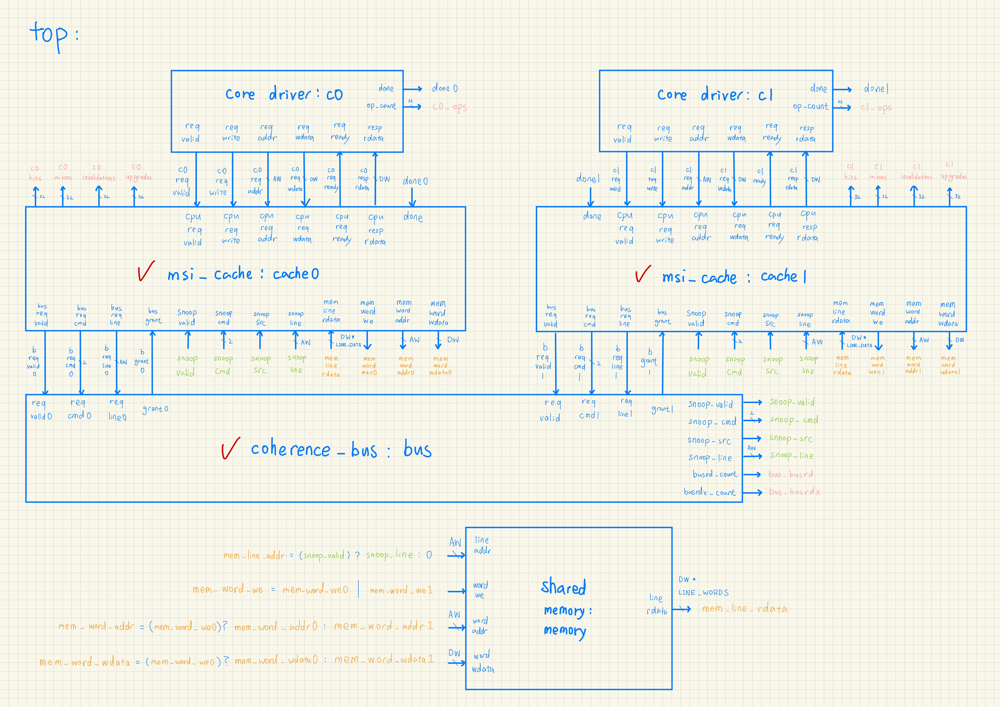
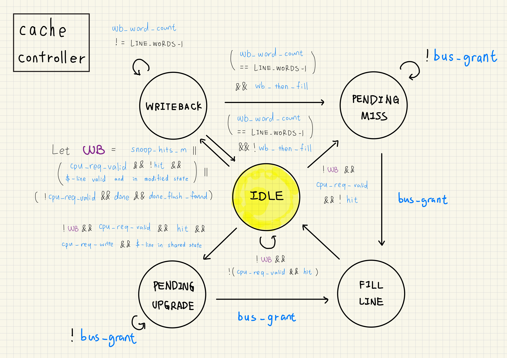
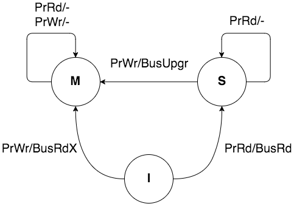
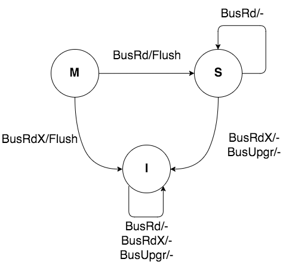
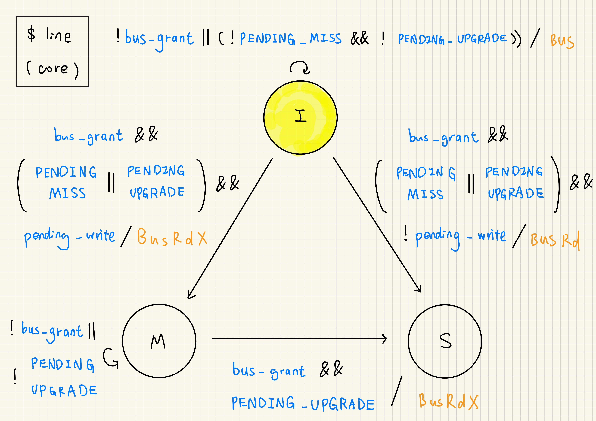
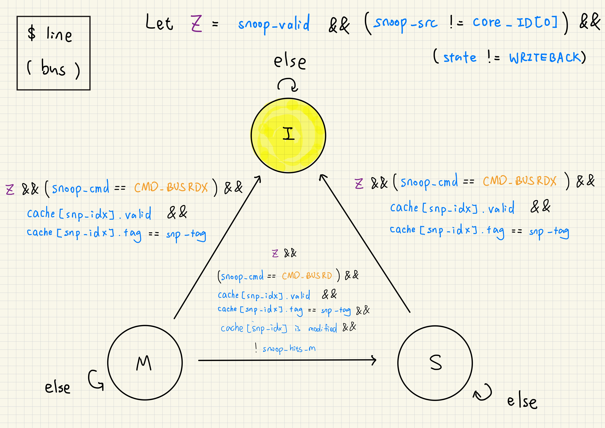

# Project 3. Historgram Binning: Data Layouts on a Dual-Core MSI-Coherent Processor

## 1. Introduction

In project 3, students need first implement a MSI-coherent dual core system, which is then used to execute a histogram binning workload to explore how data layouts affect coherence traffic and performance. Each core runs a deterministic workload driver that replays an address trace, issuing read-modify-write requests (load → increment → store) against a write-back, direct-mapped, blocking private cache. Four workload variants are provided — `shared bins`, `false sharing`, `padded bins`, and `local bins` — each designed to isolate a different interaction between the MSI state machine and cache line granularity. By running all four and comparing bus transaction counts, invalidations, and total cycle counts, students will learn why cache-line-level coherence means that even logically independent data can generate expensive bus traffic, and how data layout choices directly control that cost.

## 2. Workflow

```bash
$ bash run.sh
```

## 3. Design

- MSI
- write-back
- blocking
- direct-mapped, 4 words/line
- requires a final flush before the final memory state inspection

<p align="center"></p>
<p align="center"></p>
<p align="center">
    
    
</p>
<p align="center">  </p>
<p align="center">  </p>


## 4. Workloads

### 4.1 Trace format

Each trace line is one hexadecimal word address. For every address, the driver performs:

```text
load bin[address]
store bin[address] + 1
```

The address is a word address, not a byte address. With four-word cache lines, addresses `00`, `01`, `02`, and `03` map to the same cache line, while address `04` maps to the next line.

### 4.2 Workload Variants

| Target | Trace files | Purpose |
|---|---|---|
| `shared_bins` | `workloads/shared_bins_core0.trace`, `workloads/shared_bins_core1.trace` | Both cores update compact global bins. This demonstrates coherence traffic and also shows that coherence is not atomicity. |
| `false_sharing` | `workloads/false_sharing_core0.trace`, `workloads/false_sharing_core1.trace` | The cores update different words in the same cache line. This exposes false sharing and ownership ping-pong. |
| `padded_bins` | `workloads/padded_bins_core0.trace`, `workloads/padded_bins_core1.trace` | The cores update words in different cache lines. This should reduce unnecessary invalidations. |
| `local_bins` | `workloads/local_bins_core0.trace`, `workloads/local_bins_core1.trace` | Each core uses private local histogram bins. This models local accumulation before a merge step. |


| core0 / core1 | `shared_bins` | `false_sharing` | `padded_bins` | `local_bins` |
|---|---|---|---|---|
| request 1 | 00 / 00 | 00 / 01 | 00 / 04 | 10 / 20 |
| request 2 | 01 / 01 | 00 / 01 | 00 / 04 | 11 / 21 |
| request 3 | 02 / 02 | 00 / 01 | 00 / 04 | 12 / 22 |
| request 4 | 03 / 03 | 00 / 01 | 00 / 04 | 13 / 23 |
| request 5 | 00 / 00 | 00 / 01 | 00 / 04 | 10 / 20 |
| request 6 | 01 / 01 | 00 / 01 | 00 / 04 | 11 / 21 |
| request 7 | 02 / 02 | 00 / 01 | 00 / 04 | 12 / 22 |
| request 8 | 03 / 03 | 00 / 01 | 00 / 04 | 13 / 23 |
| request 9 | 00 / 00 | 00 / 01 | 00 / 04 | 10 / 20 |
| request 10 | 01 / 01 | 00 / 01 | 00 / 04 | 11 / 21 |
| request 11 | 02 / 02 | 00 / 01 | 00 / 04 | 12 / 22 |
| request 12 | 03 / 03 | 00 / 01 | 00 / 04 | 13 / 23 |
| request 13 | 00 / 00 | 00 / 01 | 00 / 04 | 10 / 20 |
| request 14 | 01 / 01 | 00 / 01 | 00 / 04 | 11 / 21 |
| request 15 | 02 / 02 | 00 / 01 | 00 / 04 | 12 / 22 |
| request 16 | 03 / 03 | 00 / 01 | 00 / 04 | 13 / 23 |

## 5. Results

|  | **shared_bins** | **false_sharing** | **padded_bins** | **local_bins** |
|---|---:|---:|---:|---:|
| **cycles** | 88 | 88 | 52 | 52 |
| **hits** | 56 | 56 | 62 | 62 |
| **misses** | 8 | 8 | 2 | 2 |
| **BusRd** | 8 | 8 | 2 | 2 |
| **BusRdX** | 13 | 13 | 2 | 2 |
| **invalidations** | 13 | 13 | 0 | 0 |

- **`shared_bins` vs `false_sharing`:** Both workloads produce identical numbers across every metric. Even though the cores in `false_sharing` write to different words, those words land on the same cache line, so the MSI protocol sees the same sequence of ownership transfers and invalidations as true sharing. The protocol has no visibility below the line boundary.

- **`padded_bins` vs `local_bins`:** Both workloads also match exactly. Once each core's data occupies its own cache line, there is no cross-core line ownership contention regardless of whether the addresses are in a shared region or a private one. Misses drop from 8 to 2, invalidations fall to 0, and total cycles drop by 41% (88 → 52).

- **`shared_bins`/`false_sharing` vs `padded_bins`/`local_bins`:** The 36-cycle difference comes entirely from the 13 invalidation round-trips in the high-traffic workloads. Each invalidation forces the other core to re-fetch the line as Modified before it can write, turning what would be a cache hit into a miss with a bus transaction.

## 6. Conclusion

The central result of this project is that `false_sharing` is indistinguishable from true sharing at the hardware level. The MSI protocol tracks ownership per cache line, so two cores writing to different words on the same line generate the exact same `BusRdX` upgrades and invalidations as two cores writing to the same word. Padding data to separate lines (`padded_bins`) was sufficient to eliminate all cross-core invalidations and match the performance of fully private storage (`local_bins`).

Going forward, pad each thread's accumulators to a full cache line boundary. In C/C++, `alignas(64)` on a per-thread struct is the standard mechanism. Privatization can be used where padding is impractical: each thread writes only into private storage during the parallel phase and reduces into shared memory once at the end, naturally avoiding all mid-computation coherence traffic.
