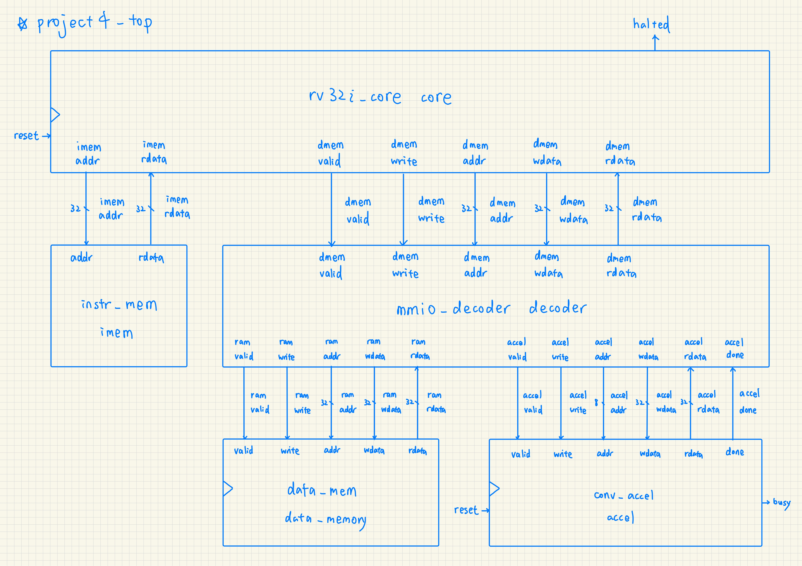
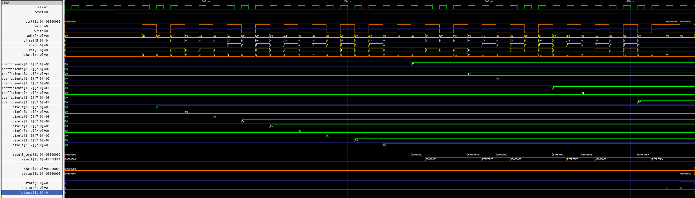
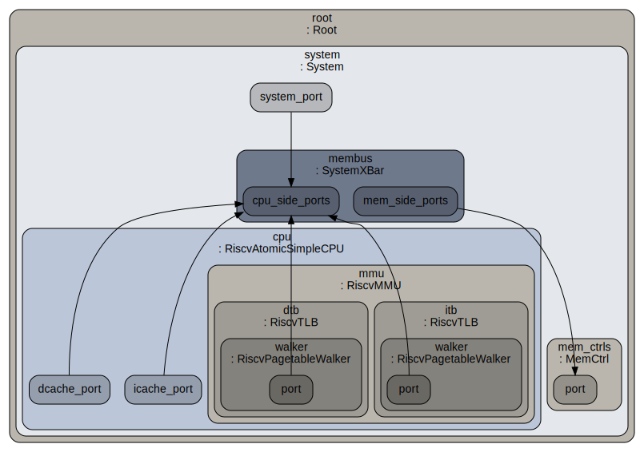

# Project 4. 2D Convolution Acceleration and Gem5 Custom Instruction Addition

## 1. Introdcution

Project 4 consists of 2 tasks. **Task 1** involves building a 2D convolution accelerator system, the host and decoder rtl is given but the accelerator circuit (`rtl/conv_accel.sv`) still requires implementation. **Task 2** asks student to simulate a 4-element packed custom instruction in Gem5, which involves modifying the Gem5's ISA parser to make Gem5 successfully emit the custom `xdot4` instruction. `conv2d_xdot4.c` is compared against a baseline (`conv2d_scalar.c`), a dataflow-optimized version (`conv2d_optimized.c`). The correctness of all runs are verified against the baseline by returning the output checksum. **These two tasks implementations seem unrelated but are actually two sides of the same coin. In a real custom instruction addition process, an architect can first validate their idea using the Gem5 simulation and avoid wasting time on the potentially unhelpful processor datapath and control logic implementation.**

## 2. Task 1: 2D Convolution Accelerator System

A RISC-V-controlled system that drives a memory-mapped convolution accelerator is provided. Only a coherent, MMIO accelerator `rtl/conv_accel.sv` requires implementation.

### 2.1 Workflow

```bash
$ bash run_accel.sh
```
### 2.2 System Architecture

<p align="center"></p>

### 2.3 `conv_accel.sv`'s Behavior

- accept MMIO writes for 9 pixels and 9 kernel coefficients
- accept `CTRL[0] = start`
- compute signed 3x3 convolution
- expose `STATUS[0] = done`, `STATUS[1] = busy`
- return signed 32-bit result at `RESULT`

### 2.4 Accelerator Register Map

| Offset    | Register        | Direction | Meaning                                      |
|-----------|-----------------|-----------|----------------------------------------------|
| 0x00      | CTRL            | Write     | bit 0 = start convolution                   |
| 0x04      | STATUS          | Read      | bit 0 = done, bit 1 = busy                  |
| 0x08      | RESULT          | Read      | signed 32-bit convolution result             |
| 0x10–0x30 | PIXEL0–PIXEL8   | Write     | unsigned 8-bit input window values in wdata[7:0]  |
| 0x40–0x60 | KERNEL0–KERNEL8 | Write     | signed 8-bit kernel coefficients in wdata[7:0]    |

### 2.5 Design Discussion

- This design assumes coherent accelerator design. To relieve interconnect traffic, non-coherent design and fence are required.
- This design kernel uses combinational convolution circuit, pipeline this critical path to fit your timing requirements.
- This design only asserts the `STATUS[0] = done` for exactly 1 cycle, which is fragile in a polling system in programming I/O. Use interrupts, two-way handshakes, extended done signals instead for a more reliable system.

### 2.6 Verification

The testbench (`tb_project4.sv`) drives a single RISC-V program (`program_conv.hex`) that runs four back-to-back convolutions through the MMIO accelerator. After reset is released, the CPU writes pixel and kernel values, pulses `CTRL[0]=1`, polls `STATUS[0]` until done, reads `RESULT`, and stores it to data memory. When the program hits `ebreak`, the testbench reads `data_memory.mem_array[0..3]` and compares each against a golden value.

| # | Pixel window (row-major)          | Kernel (row-major)                  | Filter type        | Expected |
|---|-----------------------------------|-------------------------------------|--------------------|----------|
| 1 | `[1,2,3 / 4,5,6 / 7,8,9]`        | `[ 1, 0,-1 / 1, 0,-1 / 1, 0,-1]`  | Prewitt vertical   | **-6**   |
| 2 | `[9,8,7 / 6,5,4 / 3,2,1]`        | `[ 1, 1, 1 / 0, 0, 0 /-1,-1,-1]`  | Prewitt horizontal | **18**   |
| 3 | `[2,4,6 / 8,10,12 / 14,16,18]`   | `[ 0, 1, 0 / 1,-4, 1 / 0, 1, 0]`  | Laplacian          | **0**    |
| 4 | `[5,5,5 / 5,5,5 / 5,5,5]`        | `[ 1, 1, 1 / 1, 1, 1 / 1, 1, 1]`  | Box (mean)         | **45**   |

The four cases are chosen to stress different aspects of the accelerator:

- **Test 1** (Prewitt-X, ascending ramp): exercises signed subtraction across columns — left columns sum to 12, right columns sum to 18, giving −6.
- **Test 2** (Prewitt-Y, descending ramp): exercises signed subtraction across rows — top row sums to 24, bottom row to 6, giving 18.
- **Test 3** (Laplacian, linear ramp): the discrete Laplacian of any affine (linear) function is identically zero, so the expected result is 0 regardless of the slope — this catches sign or accumulator errors that happen to cancel in other tests.
- **Test 4** (box filter, uniform input): all nine multiply-accumulate terms are equal (5×1=5 each), so the result is 9×5=45 — confirms the accumulator sums all nine products without dropping any.

The simulation passes when all four `check_word` assertions succeed and the testbench prints `PASS: RISC-V-controlled convolution accelerator produced expected outputs`. A timeout after 200 cycles without `halted` indicates the program or polling loop did not terminate.

<p align="center"></p>

▲ timing diagram


## 3. Task 2: Gem5 RISC-V Custom Instruction Simulation

- Given baseline and optimized 2D convolution workloads, plus a starter wrapper for a RISC-V custom `xdot4` instruction.
- Run scalar and optimized convolution, add the `xdot4` instruction in gem5, replace the C fallback wrapper with inline assembly, and compare gem5 statistics.
- Bind the chosen custom-0 opcode/funct fields to an instruction class that computes the four signed 8-bit products and returns their 32-bit sum.
- Note that Task 2 is NOT A CUSTOM INSTRUCTION RTL IMPLEMENTATION, but rather a Gem5 custom instruction simulation.

### 3.1 Workflow

```bash
$ bash run_gem5.sh
```

### 3.2 System Under Simulation

<p align="center"></p>

### 3.3 Workload

``` c
out[y][x] = sum over a 3x3 input window of pixel[y+dy][x+dx] * kernel[dy][dx]
```

### 3.4 `conv2d_scalar.c` Design (Baseline)

``` cpp
for (int y = 1; y < H-1; y++) {
    for (int x = 1; x < W-1; x++) {
        int acc = 0;
        for (int ky = 0; ky < 3; ky++) {
            for (int kx = 0; kx < 3; kx++) {
                acc += (int)input_image[y + ky - 1][x + kx - 1] * (int)kernel3x3[ky][kx];
            }
        }
        out[y][x] = acc;
    }
}
```

### 3.5 `conv2d_optimized.c` Design (Loop Unrolling)

``` cpp
const int k00 = kernel3x3[0][0], k01 = kernel3x3[0][1], k02 = kernel3x3[0][2];
const int k10 = kernel3x3[1][0], k11 = kernel3x3[1][1], k12 = kernel3x3[1][2];
const int k20 = kernel3x3[2][0], k21 = kernel3x3[2][1], k22 = kernel3x3[2][2];
for (int y = 1; y < H-1; y++) {
    // loop hoisting
    const unsigned char *r0 = input_image[y-1];
    const unsigned char *r1 = input_image[y];
    const unsigned char *r2 = input_image[y+1];
    for (int x = 1; x < W-1; x++) {
        // loop unrolling
        int acc = 0;
        // address calculaiton simplification
        acc += r0[x-1]*k00 + r0[x]*k01 + r0[x+1]*k02;
        acc += r1[x-1]*k10 + r1[x]*k11 + r1[x+1]*k12;
        acc += r2[x-1]*k20 + r2[x]*k21 + r2[x+1]*k22;
        out[y][x] = acc;
    }
}
```

### 3.6 `conv2d_xdot4.c` Design (Custom Instruction)

``` cpp
static inline int pack4_u8(unsigned char a0, unsigned char a1, unsigned char a2, unsigned char a3) {
    return ((int)a0 & 0xff) | (((int)a1 & 0xff) << 8) | (((int)a2 & 0xff) << 16) | (((int)a3 & 0xff) << 24);
}

static inline int pack4_s8(signed char a0, signed char a1, signed char a2, signed char a3) {
    return ((int)(unsigned char)a0) | (((int)(unsigned char)a1) << 8) | (((int)(unsigned char)a2) << 16) | (((int)(unsigned char)a3) << 24);
}

static inline int xdot4(int packed_pixels, int packed_coeffs) {
    // zero-extend to 64-bit
    long rs1 = (unsigned int)packed_pixels;
    long rs2 = (unsigned int)packed_coeffs;
    long rd;

    asm volatile (".insn r 0x0b, 0x0, 0x01, %0, %1, %2"
                  : "=r"(rd)
                  : "r"(rs1), "r"(rs2));

    return (int)rd;
}

int main(void) {
    for (int y = 1; y < H-1; y++) {
        for (int x = 1; x < W-1; x++) {
            int p0 = pack4_u8(input_image[y-1][x-1], input_image[y-1][x], input_image[y-1][x+1], input_image[y][x-1]);
            int k0 = pack4_s8(kernel3x3[0][0], kernel3x3[0][1], kernel3x3[0][2], kernel3x3[1][0]);
            int p1 = pack4_u8(input_image[y][x], input_image[y][x+1], input_image[y+1][x-1], input_image[y+1][x]);
            int k1 = pack4_s8(kernel3x3[1][1], kernel3x3[1][2], kernel3x3[2][0], kernel3x3[2][1]);
            int acc = xdot4(p0, k0) + xdot4(p1, k1);
            acc += (int)input_image[y+1][x+1] * (int)kernel3x3[2][2];
            out[y][x] = acc;
        }
    }
    // ...
}
```

- semantic model

``` c
uint32_t xdot4(uint32_t rs1, uint32_t rs2) {
    int32_t acc = 0;
    for (int i = 0; i < 4; ++i) {
        int8_t a = (int8_t)((rs1 >> (8*i)) & 0xff);
        int8_t b = (int8_t)((rs2 >> (8*i)) & 0xff);
        acc += (int32_t)a * (int32_t)b;
    }
    return (uint32_t)acc;
}
```

### 3.7 Gem5 Custom Instruction Simulation

- custom instruciton `xdot4` assumptions:
    - signedness:
        - `input_image`: packed as unsigned using `packed_u4`
        - `kernel`: packed as signed using `packed_s4`
        - `xdot4` custom instruction: each word-wide operand is re-evaluated as signed, acc is also signed
    - overflow: to prevent overflow when MACing word-wide pairs, `acc` in `xdot4` is declared as `int32_t`.
    - Though `xdot4` encoding is 32-bit as per RV32IM, the compile flags are 64-bit (`-march=rv64imafd -mabi=lp64d`) to circumvent linkage errors as the system libraries are 64-bit wide. Some tricks have to be carried out in the app program to preserve correctness.

``` bash
$ riscv64-linux-gnu-gcc -O2 -static -march=rv64imafd -mabi=lp64d -o build/${BENCH}.riscv gem5/src/${BENCH}.c
```

- **Step 1**: Modify `/opt/gem5/src/arch/riscv/isa/decoder.isa` (The exact gem5 decoder patch is version-dependent).

``` cpp
0x02: decode FUNCT3 {
    0x0: decode FUNCT7 {
        0x01: ROp::xdot4({{
            int32_t acc = 0;
            for (int i = 0; i < 4; i++) {
                int8_t a = (int8_t)((Rs1_uw >> (8*i)) & 0xFF);
                int8_t b = (int8_t)((Rs2_uw >> (8*i)) & 0xFF);
                acc += (int32_t)a * (int32_t)b;
            }
            Rd_sw = acc;
        }}, IntMultOp);
    }
}
```
- **Step 2**: Rebuild Gem5.

``` bash
$ scons /opt/gem5build/RISCV/gem5.opt -j$(nproc)
```

- **Step 3**: `xdot4` inline invocation in `gem5/src/conv2d_xdot4.c`.

``` c
static inline int xdot4(int packed_pixels, int packed_coeffs) {
    long rs1 = (unsigned int)packed_pixels;
    long rs2 = (unsigned int)packed_coeffs;
    long rd;

    // intended behavior: rd = signed_dot4(rs1[4 x int8], rs2[4 x int8])
    asm volatile (".insn r 0x0b, 0x0, 0x01, %0, %1, %2"
                  : "=r"(rd)
                  : "r"(rs1), "r"(rs2));
    return (int)rd;
}
```

- **Step 4**: Correctness of each run is verified by comparing the output checksum with golden at the end of each function.

``` c
volatile int sink;
int out[H][W];

int main(void) {
    // ...
    sink = checksum_output(out);
    return sink == -36456 ? 0 : 1;
}
```

- **Step 5**: We can confirm that `xdot4` has been emitted succesfully by Gem5 by inspecting the disassembly of `conv2d_xdot4`.

``` bash
$ make inspect_asm
```

``` S
# ...
104f4:	02071713          	slli	a4,a4,0x20
104f8:	02075713          	srli	a4,a4,0x20
104fc:	03d7070b          	.insn	4, 0x03d7070b # xdot4 custom instruction
10500:	0025c783          	lbu	a5,2(a1)
10504:	00064283          	lbu	t0,0(a2)
10508:	0015c383          	lbu	t2,1(a1)
1050c:	00164503          	lbu	a0,1(a2)
10510:	0102929b          	slliw	t0,t0,0x10
10514:	0087979b          	slliw	a5,a5,0x8
10518:	0057e7b3          	or	a5,a5,t0
1051c:	0077e7b3          	or	a5,a5,t2
10520:	0185151b          	slliw	a0,a0,0x18
10524:	00a7e7b3          	or	a5,a5,a0
10528:	02079793          	slli	a5,a5,0x20
1052c:	0207d793          	srli	a5,a5,0x20
10530:	03c7878b          	.insn	4, 0x03c7878b # xdot4 custom instruction
10534:	00264503          	lbu	a0,2(a2)
# ...
```

### 3.8 Gem5 Performance Results

| Workload        | simInsts | simSeconds | CPI      |
|-----------------|----------|------------|----------|
| `scalar`        | 131,132  | 0.000085   | 1.302398 |
| `optimized`     | 117,501  | 0.000079   | 1.337486 |
| `xdot4`         | 119,954  | 0.000080   | 1.330568 |

Comparing the performance results of `optimized` and `xdot4`, we can observe that `simInsts`, `simSeconds`, and `CPI` have all improved, and `optimized` performs even slightly better than `xdot4`. From this result, we can conclude that custom instruction isn't always the best solution. For example, the packing process as well consumes clock cycles and the additional impact on circuit PPA hasn't been accounted for here.

## 4. Discussion

1. Why is 2D convolution suitable for acceleration? 
Ans: The 3×3 convolution kernel is a fixed, data-independent multiply-accumulate loop over 9 element pairs, so all nine MACs are independent and can be collapsed into a single combinational dot product with no control overhead.

2. Which operations dominate the scalar implementation? 
Ans: The innermost loop's nine integer multiplies and eight accumulating adds dominate, repeated once per output pixel with address calculations adding extra load/store instructions on top.

3. How does xdot4 reduce dynamic instruction count? 
Ans: It folds four multiply-accumulate pairs into one instruction, replacing ~8 multiplies and ~7 adds with two `xdot4` calls plus one remaining scalar MAC, shrinking the per-pixel arithmetic from ~9 multiplies to 3 instructions.

4. Why can speedup be smaller than arithmetic-instruction reduction? 
Ans: The packing (`slli`/`or`) overhead before each `xdot4` call consumes extra instructions, and load/store and branch instructions that cannot be eliminated still dominate the remaining cycle budget.

5. How do row-major traversal and cache locality affect performance? 
Ans: Accessing `input_image` row-by-row keeps stride-1 loads in the same cache line, so the optimized and xdot4 variants benefit from sequential spatial locality and avoid the penalty of strided column accesses.

6. How does the RTL memory-mapped accelerator differ from the gem5 custom instruction? 
Ans: The MMIO accelerator is a separate hardware block managed by explicit load/store to fixed addresses and a polling handshake, while the gem5 custom instruction is a single in-pipeline opcode that computes the dot product inside the CPU's execute stage with no memory traffic.

7. What is the hardware/software contract between the RISC-V core and conv_accel.sv? 
Ans: The CPU writes 9 pixel and 9 kernel values via MMIO stores, then sets `CTRL[0]=1` to start; the accelerator pulses `STATUS[0]=1` for exactly one cycle when done, and the CPU must read `RESULT` in that same cycle or re-trigger — a fragile one-cycle handshake that requires tight polling.

8. What limitations remain in this project compared with a real convolution accelerator? 
Ans: The accelerator processes only one 3×3 window at a time with a single combinational path (no pipelining or batching), uses a software polling loop instead of interrupts, and lacks DMA, so memory bandwidth and per-call MMIO overhead would become bottlenecks at scale.

## 5. Conclusion

Building the MMIO accelerator in **Task 1** revealed how much protocol overhead — nine pixel writes, nine kernel writes, a start pulse, and a polling loop — a host must pay just to launch a single 3×3 dot product; the unoptimized compute itself is trivial compared with the handshake, which can be improved by offloading data movement to DMA. **Task 2** showed the opposite extreme: folding that same dot product into a single in-pipeline instruction eliminates all memory traffic, yet the packing code that feeds `xdot4` costs enough instructions that `conv2d_optimized` — pure scalar, no custom silicon — still matches its performance. **Together**, the two tasks mirror an architect's real workflow: the Gem5 simulation in Task 2 is the low-cost feasibility check that should precede the RTL commitment in Task 1 — and the marginal gap between `xdot4` and `conv2d_optimized` is exactly the kind of evidence that would make an architect reconsider building the custom silicon at all.
